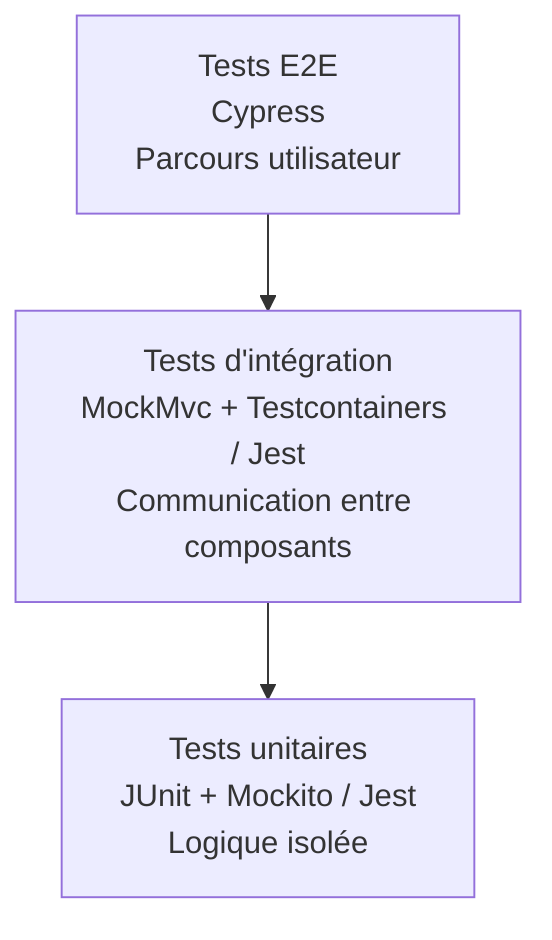

# Étape 02 — Plan de tests

## Objectif

Définir les tests à réaliser pour vérifier le fonctionnement nominal de l'application EtuBibliothèque côté backend et frontend.

Cette étape produit un plan de tests. Elle ne modifie pas le code et ne demande pas encore d'implémenter les nouveaux scénarios.

## Pyramide des tests

La stratégie suit une pyramide : beaucoup de tests unitaires rapides, moins de tests d'intégration, et quelques tests E2E couvrant les parcours essentiels.

## Outils retenus

| Périmètre | Outil | Usage |
|---|---|---|
| Backend | JUnit 5 | Exécution et organisation des tests Java |
| Backend | Mockito | Simulation des repositories et dépendances des services |
| Backend | MockMvc | Appels HTTP simulés vers les contrôleurs Spring |
| Backend | Testcontainers | Base MySQL temporaire pour les tests d'intégration |
| Frontend | Jest + jest-preset-angular | Tests unitaires et tests d'intégration Angular |
| Frontend | Cypress | Tests E2E dans un navigateur réel, à configurer |

## Périmètre fonctionnel

Le plan couvre les fonctionnalités actuellement disponibles après les étapes d'implémentation :

- inscription d'un agent ;
- authentification d'un agent ;
- émission et conservation d'un token JWT ;
- accès à la gestion des étudiants ;
- création, consultation, modification et suppression d'un étudiant ;
- redirections frontend ;
- protection de la route étudiante.

## Cas nominaux backend

Les cas suivants décrivent le comportement attendu avec des données valides. Les cas d'erreur et les effets de bord sont volontairement réservés à une phase ultérieure, conformément aux consignes de l'exercice.

| ID | Fonctionnalité | Niveau | Entrée | Résultat attendu | Outil |
|---|---|---|---|---|---|
| BE-UNIT-01 | Inscrire un agent | Unitaire | Objet `User` valide | Le mot de passe est encodé et l'utilisateur est sauvegardé | JUnit + Mockito |
| BE-UNIT-02 | Authentifier un agent | Unitaire | Login et mot de passe valides | `AuthenticationManager` authentifie l'utilisateur et le service demande un JWT | JUnit + Mockito |
| BE-UNIT-03 | Générer un JWT | Unitaire | `UserDetails` authentifié | Un token signé contenant le sujet et une expiration est retourné | JUnit |
| BE-UNIT-04 | Créer un étudiant | Unitaire | `StudentRequestDTO` valide | L'étudiant est converti puis sauvegardé | JUnit + Mockito |
| BE-UNIT-05 | Consulter un étudiant | Unitaire | Identifiant existant | Le DTO de réponse contient les données de l'étudiant | JUnit + Mockito |
| BE-UNIT-06 | Modifier un étudiant | Unitaire | Identifiant existant + DTO valide | Les champs sont modifiés et la réponse contient les nouvelles données | JUnit + Mockito |
| BE-UNIT-07 | Supprimer un étudiant | Unitaire | Identifiant existant | L'étudiant est supprimé du repository | JUnit + Mockito |
| BE-INT-01 | Inscription HTTP | Intégration | `POST /api/register` avec un JSON valide | La réponse HTTP est `201 Created` | MockMvc + MySQL temporaire |
| BE-INT-02 | Authentification HTTP | Intégration | `POST /api/login` avec des identifiants valides | La réponse HTTP est `200 OK` et contient un JWT | MockMvc + MySQL temporaire |
| BE-INT-03 | CRUD étudiant HTTP | Intégration | Appels CRUD avec `Authorization: Bearer <token>` | Les réponses sont `201`, `200` et `204` selon l'opération | MockMvc + MySQL temporaire |

## Cas nominaux frontend

| ID | Fonctionnalité | Niveau | Entrée | Résultat attendu | Outil |
|---|---|---|---|---|---|
| FE-UNIT-01 | Construire le formulaire de connexion | Unitaire | Initialisation de `LoginComponent` | Les champs `login` et `password` sont disponibles | Jest |
| FE-UNIT-02 | Soumettre le login | Unitaire | Formulaire valide | `UserService.login()` est appelé avec le DTO attendu | Jest |
| FE-UNIT-03 | Stocker le JWT | Unitaire | Réponse API contenant un token | Le token est enregistré sous `authToken` | Jest |
| FE-UNIT-04 | Construire le formulaire étudiant | Unitaire | Initialisation de `StudentsComponent` | Les champs prénom, nom et e-mail sont disponibles | Jest |
| FE-UNIT-05 | Ajouter un étudiant | Unitaire/intégration | DTO étudiant valide | `StudentService.create()` est appelé et la liste est rechargée | Jest |
| FE-UNIT-06 | Modifier un étudiant | Unitaire/intégration | Étudiant sélectionné et données valides | `StudentService.update()` est appelé et le détail est actualisé | Jest |
| FE-UNIT-07 | Supprimer un étudiant | Unitaire/intégration | Étudiant sélectionné | `StudentService.delete()` est appelé et la liste est rechargée | Jest |
| FE-INT-01 | Ajouter le Bearer Token | Intégration | Requête frontend vers `/api/students` avec `authToken` | L'intercepteur ajoute l'en-tête `Authorization` | Jest |
| FE-INT-02 | Protéger une route | Intégration | Navigation vers `/students` avec un token | La navigation est autorisée | Jest |
| FE-E2E-01 | Connexion et arrivée sur la liste | E2E | Saisie d'identifiants valides dans `/login` | Le JWT est reçu et l'utilisateur arrive sur `/students` | Cypress |
| FE-E2E-02 | Inscription puis connexion | E2E | Remplissage du formulaire `/register` | Une confirmation s'affiche puis le lien mène vers `/login` | Cypress |
| FE-E2E-03 | Parcours CRUD étudiant | E2E | Ajout, modification puis suppression depuis `/students` | Les données affichées correspondent aux actions réalisées | Cypress |

## Scénarios prioritaires

Pour commencer par les tests les plus simples, l'ordre recommandé est :

1. `BE-UNIT-01` à `BE-UNIT-07` : logique métier isolée ;
2. `FE-UNIT-01` à `FE-UNIT-07` : composants et services Angular ;
3. `BE-INT-01` à `BE-INT-03` : API et persistance ;
4. `FE-INT-01` et `FE-INT-02` : intercepteur et guard ;
5. `FE-E2E-01` à `FE-E2E-03` : parcours utilisateur avec Cypress.

## Hors périmètre de cette étape

Conformément aux consignes de l'exercice, ce plan initial ne détaille pas encore :

- les cas d'erreur HTTP ;
- les identifiants invalides ;
- les champs manquants ou mal formés ;
- les tokens expirés ou falsifiés ;
- les étudiants introuvables ;
- les effets de bord détaillés en base ;
- les tests de performance et de charge.

Ces scénarios sont néanmoins importants pour la qualité finale. Ils pourront être ajoutés dans un plan de robustesse séparé après la validation des scénarios nominaux.

## État par rapport au code actuel

Une partie de ce plan est déjà couverte par les tests présents dans le projet :

- backend : `UserServiceTest`, `StudentServiceTest` et `UserControllerTest` ;
- frontend : tests Jest du service utilisateur, du composant racine, de l'inscription et de la connexion.

Les tests E2E Cypress restent à configurer et à écrire. Les vérifications réalisées manuellement avec Playwright ne sont pas comptées comme des tests Cypress versionnés.

## Critère de validation

L'étape 2 sera considérée comme préparée lorsque :

- chaque fonctionnalité possède au moins un cas de test identifié ;
- chaque cas indique son entrée et sa sortie attendue ;
- le niveau de test et l'outil sont précisés ;
- les scénarios nominaux sont distingués des futurs scénarios d'erreur ;
- les cas sont ordonnés selon la pyramide des tests.
